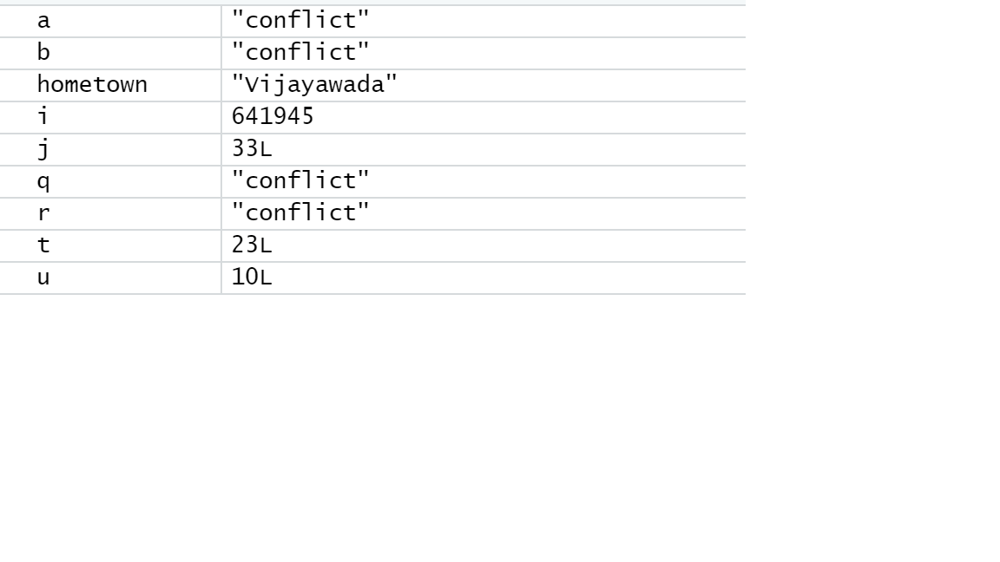
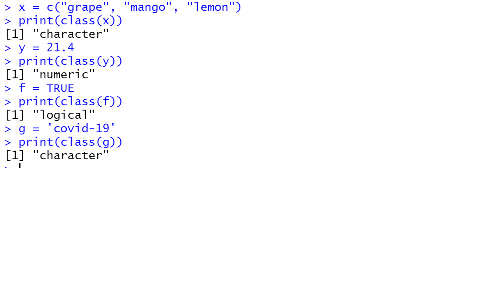
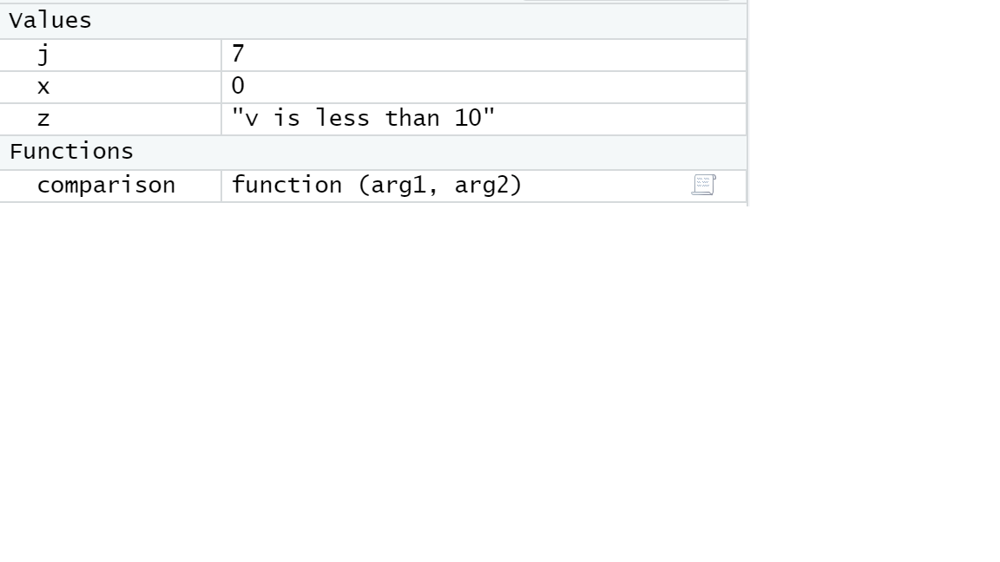
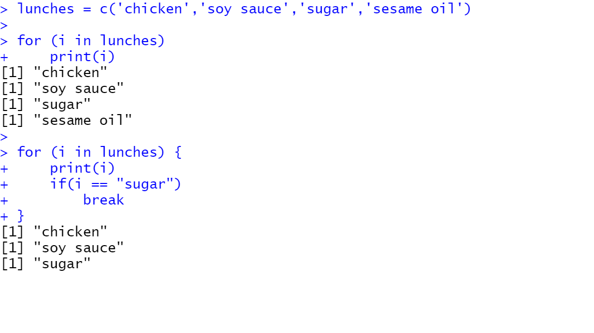

Below is the screenshot of the first question which is variables

Below is the screenshot of the second question which is finding data types

Below is the screenshot of the third question which is If-Else & Scope

Below is the screenshot of the fourth question which is Iteration (iterating a for loop)

